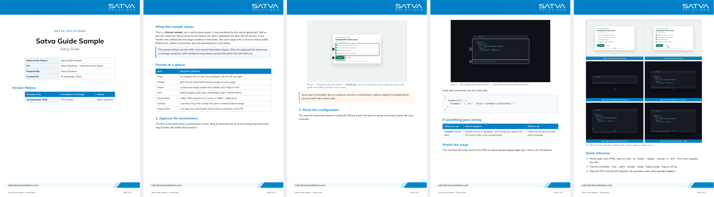
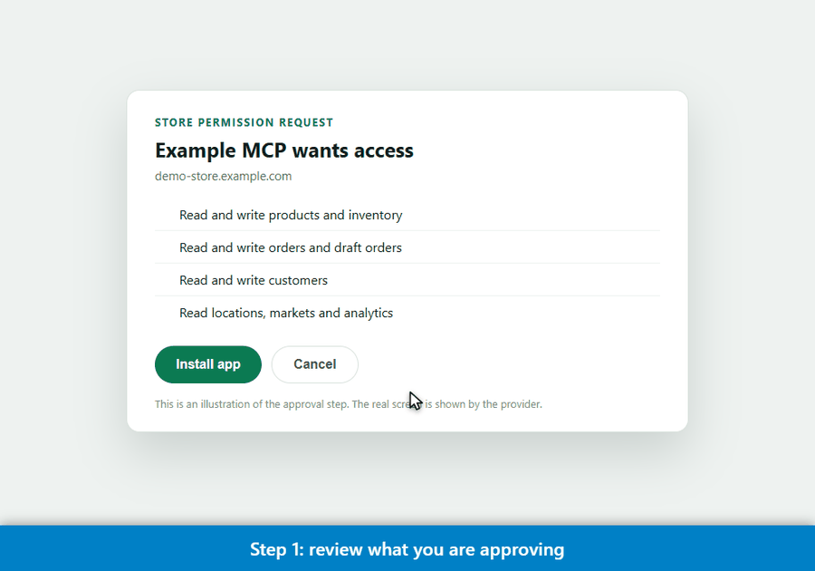
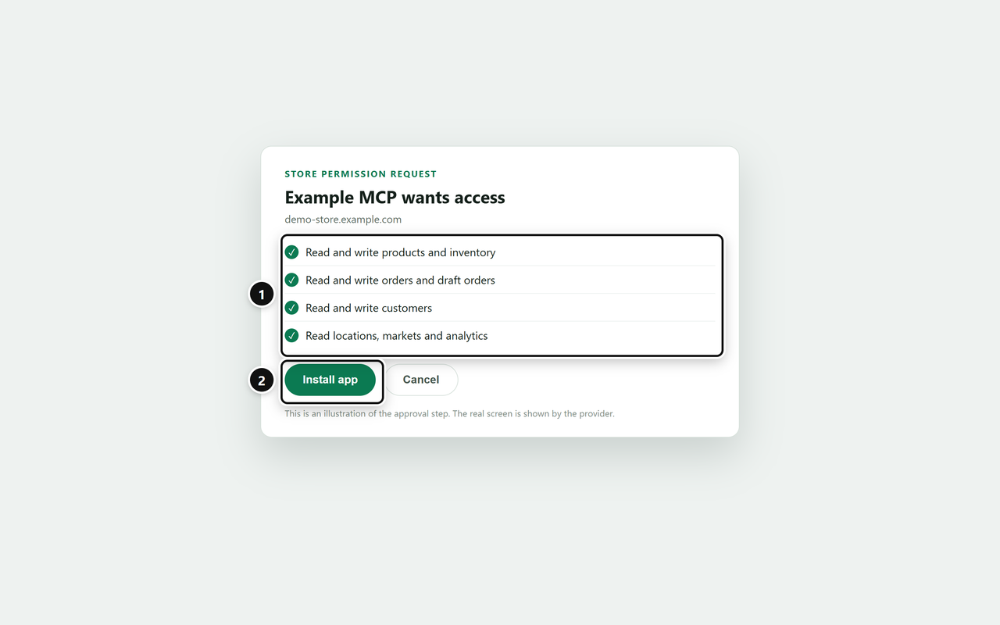
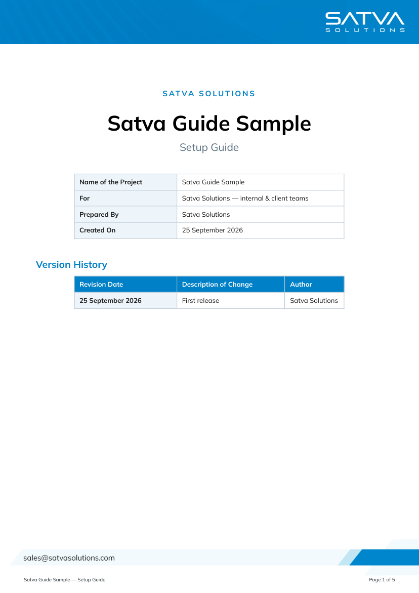

<div align="center">

# Satva COE · Skills & Agents

**Turn a running app into a branded PDF guide, a narrated demo GIF and a launch video — with one sentence to Claude.**

[](LICENSE)
[](https://docs.claude.com/en/docs/claude-code/skills)




<sub>The sample guide in <a href="examples/setup-guide-sample/"><code>examples/setup-guide-sample/</code></a> — generated by the skills in this repo.</sub>

</div>

---

## Contents

[What's inside](#whats-inside) · [See it](#see-it) · [Features](#features) · [Install](#install) · [Quick start](#quick-start) · [Make it your own](#make-it-your-own-brand) · [Repo layout](#repository-layout) · [Dependencies & credits](#dependencies--credits) · [Verified status](#verified-status) · [Troubleshooting](#troubleshooting) · [License](#license)

---

## What's inside

Four [Claude Code skills](https://docs.claude.com/en/docs/claude-code/skills). Install them once and Claude picks the right one from what you ask.

| Skill | Produces | For whom | Say something like |
|---|---|---|---|
| 📘 **[`satva-guide-gif`](skills/satva-guide-gif/SKILL.md)** | Annotated screenshots · narrated demo **GIF** · branded A4 **PDF** guide | End users and clients of a shipped feature | *"Create a setup guide PDF and demo GIF for the billing feature."* |
| 📝 **[`satva-doc`](skills/satva-doc/SKILL.md)** | Brief plain-black Word **`.doc`** | Your own team — handovers, "how we built it" | *"Write a satva doc explaining how the sync works."* |
| 🎬 **[`feature-launch-video`](skills/feature-launch-video/SKILL.md)** | Marketing / launch **video** (MP4) with original voice, music and SFX | Prospects and customers | *"Make a 30-second launch video for our bank-import feature."* |
| 🎞️ **[`satva-ledger-marketing-video`](skills/satva-ledger-marketing-video/SKILL.md)** | The full **82-second sizzle** for the Satva Ledger accounting agent — a reference pipeline to fork | Marketing team | *"Rebuild the Satva Ledger sizzle video."* · *"Make a hero video like it for our next product."* |

Anybody or any organisation can use them (MIT). To use your own logo and colours, see [Make it your own brand](#make-it-your-own-brand).

---

## See it

| | |
|---|---|
| **Narrated GIF** — a cursor glides, clicks ripple, every step is captioned<br>[`Satva-Guide-Sample-Demo.gif`](examples/setup-guide-sample/Satva-Guide-Sample-Demo.gif) |  |
| **Annotated screenshot** — numbered rings, 2880 × 1800 |  |
| **Finished PDF** — banner, footer, cover, Version History<br>[`Satva-Guide-Sample.pdf`](examples/setup-guide-sample/Satva-Guide-Sample.pdf) |  |

Also in [`examples/`](examples/): a [`satva-doc` sample](examples/satva-doc-sample/How-The-Guide-Pipeline-Works.doc) and two video briefs in [`skills/feature-launch-video/examples/`](skills/feature-launch-video/examples/).

---

## Features

### 📘 `satva-guide-gif` — screenshots, GIF and PDF from one run

Point it at a **locally running app seeded with fake data** and it produces three files that ship together.

- **Numbered callout rings** — drawn into the page before capture, badges placed *outside* the ring so they never cover the text they point at. A `report()` gate lists any selector that missed, so a ring can't silently go missing.
- **Narrated cursor GIF** — a fake cursor eases between targets, clicks ripple, a caption bar narrates each step. Encoded down a size ladder to stay under 12 MB, then **re-opened and verified** (animated, under the limit) before it is called done.
- **Storyboard** — a 2 × 3 contact sheet of the GIF's six most distinct frames, embedded at the end of the PDF.
- **House-format PDF** — Satva blue banner on every page, contact footer with `Page N of M`, Mulish typography, cover page with a Version History table, tip and warning boxes, blue-header tables, figure captions.
- **Safety rails baked in** — never film a third party's UI (cut to an illustration page instead), never show a real secret, never invent a URL, error strings copied from source.
- **A written standard, not folklore** — screenshot size, ring and border style, page geometry, type scale and colours are all specified in [`SKILL.md`](skills/satva-guide-gif/SKILL.md#the-house-standard-the-numbers).

| Standard | Value |
|---|---|
| Screenshot | 1440 × 900 viewport @2× → **2880 × 1800 px**, full viewport, no cropping, `s<NN>-<slug>.png` |
| Callout ring | 3 px `#111`, 10 px radius, white halo, 34 px numbered badge |
| Image frame in PDF | 1 px `#b9c7d4` |
| Page | A4 · margins 30 / 22 / 18 mm · banner flush to the top edge |
| Type | Mulish 10.5 pt body · h1 22 pt · h2 14 pt · Roboto Mono 9 pt code |
| Colour | Satva blue `#0080C6` · text `#1a1a1a` · warn `#d97706` |

### 📝 `satva-doc` — the short internal note

A Word-compatible `.doc` written as **one HTML file** — no pandoc, no library, nothing to install. Pure black, Mulish + Roboto Mono, fixed sizes, and a fixed outline ending in a one-sentence summary. Always built from real code read out of your repo, never from memory.

### 🎬 `feature-launch-video` — a launch video for any feature of any product

Not a template with blanks left in: it reads the real user flow, writes a **`brief.json`**, and composes a [HyperFrames](https://github.com/heygen-com/hyperframes) video from it.

| Theme | Feel | Best for |
|---|---|---|
| `ledger-clean` | light, paper, straight lines, monospace numerals | finance / ops / B2B |
| `cinematic-dark` | dark, glass cards, accent glow | AI / platform / dev tools |
| `mascot-playful` | bright, rounded, original character | consumer / SMB-friendly |

- **Grounded** — every number and line of copy traces to the brief; a demo brief is stamped *CONCEPT / NOT FINAL* on screen automatically.
- **Claims gate** — `compose.mjs` **refuses to write anything** if the copy contains a restricted claim ("autonomous", "100 % accurate"…). It is an exit code, not a comment.
- **Original audio only** — voice and SFX via ElevenLabs, the score synthesised locally in code, mixed to −14 LUFS with ducking, then *measured* by `analyze.py`. No copyrighted reference tracks, ever.
- **16:9, 9:16 or 1:1**, 25–45 s sweet spot.

### 🎞️ `satva-ledger-marketing-video` — the full sizzle, as a pipeline you can fork

The original hand-built pipeline behind the **Satva Ledger** (AI accounting agent) promo: intro → six chapters
→ "all your systems" → end card, with a mascot and sound cued to the beat. Where `feature-launch-video` is a
brief-driven generator for *any* feature, this is the **worked reference for a longer hero video** — you edit
the generator and the voice script.

- **Generator, not hand-written HTML** — `build-sizzle.mjs` builds the whole HyperFrames composition (scenes, timings, cues) from data; `sizzle-mascot.mjs` is the original SVG mascot (moods, bob, blink, wave, hop).
- **Audio pipeline** — 25 ElevenLabs voice lines placed so key words land on visual beats, custom SFX, an **original score synthesised in code** (115 BPM), a mix that ducks music under speech and masters to −14 LUFS, and `analyze.py` for measured QA.
- **Marketing-safety docs** — the approved-claims list and the beat sheet ([`docs/`](skills/satva-ledger-marketing-video/docs/)).
- **Deliberately not included:** the rendered MP4s and audio (made on a free ElevenLabs plan — non-commercial). Regenerate with your own key.

| Pick this one when… | Skill |
|---|---|
| a single feature, 25–45 s, no code edits | `feature-launch-video` |
| a multi-chapter hero / sizzle, mascot, hand-cued sound | `satva-ledger-marketing-video` |

---

## Install

### Prerequisites

| Need | For | Check |
|---|---|---|
| [Claude Code](https://docs.claude.com/en/docs/claude-code) | running the skills | `claude --version` |
| Node.js 18+ | screenshots, GIF frames, PDF, video composer | `node -v` |
| Python 3 and Pillow | GIF encoding | `pip install pillow` |
| Google Chrome **or** Playwright's Chromium | PDF and screenshots | `npx playwright install chromium` |
| *Video only:* `ffmpeg`, Python 3.11 + `numpy scipy`, an [ElevenLabs API key](https://elevenlabs.io) | audio + render | `ffmpeg -version` |

### 1 · Get the repo

```bash
git clone https://github.com/prafullakalu/Satva-COE-skills-agents.git
cd Satva-COE-skills-agents
```

### 2 · Install the skills into Claude Code

**Windows (PowerShell)**

```powershell
.\install.ps1                       # all skills, for every project  → ~\.claude\skills
.\install.ps1 -Project              # only for the current project   → .\.claude\skills
.\install.ps1 -Only satva-guide-gif,satva-doc
```

**macOS / Linux / Git Bash / WSL**

```bash
./install.sh                        # all skills, for every project  → ~/.claude/skills
./install.sh --project              # only for the current project   → ./.claude/skills
./install.sh --only satva-guide-gif,satva-doc
```

<details>
<summary><b>Or copy by hand</b></summary>

Copy the **contents** of each folder in `skills/` into `~/.claude/skills/<skill-name>/` (user level, every project) or `<your-repo>/.claude/skills/<skill-name>/` (project level, travels with your repo).

> ⚠️ Copy into a folder that **does not exist yet**, or copy the folder's contents (`skills/<name>/*`). `Copy-Item -Recurse src dest` into an *existing* `dest` creates `dest/src/` — a nested duplicate that Claude will not load. The installers avoid this.

</details>

### 3 · Restart and verify

Start a new Claude Code session and ask:

> *"Which skills do you have for Satva guides, docs and launch videos?"*

It should list `satva-guide-gif`, `satva-doc`, `feature-launch-video` and `satva-ledger-marketing-video`. Re-run the installer any time to upgrade in place.

---

## Quick start

### A · Your first guide + GIF (about 10 minutes)

**Let Claude drive.** In your project, with the app running locally on fake data:

> *"Create a Satva setup guide PDF and a narrated demo GIF for the **Connect store** flow. The app is at http://localhost:8080 — use the demo tenant."*

Claude follows [`SKILL.md`](skills/satva-guide-gif/SKILL.md): seeds demo data, captures ringed screenshots, films the GIF, writes the body HTML and builds the PDF.

**Or run the working example yourself** to see every stage:

```bash
cp -r ~/.claude/skills/satva-guide-gif/starter my-guide        # PowerShell: Copy-Item -Recurse "$HOME\.claude\skills\satva-guide-gif\starter" my-guide
cd my-guide
npm install
npx playwright install chromium        # skip if Chrome is installed
pip install pillow
npm run build                          # ~30 s → shots/, Satva-Guide-Sample-Demo.gif, storyboard.png, Satva-Guide-Sample.pdf
```

**Then make it yours** — edit three files in `my-guide/`:

| File | Change |
|---|---|
| `capture.mjs` | `page.goto` your app, change the selectors passed to `mark(...)`. Run until it prints `no selector problems`. |
| `frames.mjs` | Your steps and captions: `d.moveTo(sel)`, `d.click(sel)`, `d.type(sel, text)`, `d.caption("…")`. |
| `guide-body.html` + `doc.json` | Body-only HTML (start at `<h2>`), plus title, project name and Version History row. |

Run `npm run build` again. Ship the **PDF and the GIF together**.

> The skills live in `~/.claude/skills/satva-guide-gif`. Installed elsewhere? `export SATVA_SKILL=/path/to/satva-guide-gif` (PowerShell: `$env:SATVA_SKILL="…"`).

### B · An internal note

> *"Write a satva doc explaining how the invoice sync works."*

You get `docs/<Topic>-Guide.doc`, opening in Word, with real code snippets quoted from your repo.

### C · A launch video for your own project

**Let Claude drive:**

> *"Make a 30-second 16:9 launch video for our **bank statement import** feature. Use the cinematic-dark theme."*

It reads your feature, writes `brief.json` (grounded facts only), composes, runs the quality gate, generates audio and renders.

**Or run the pipeline by hand** with an example brief:

```bash
SKILL=~/.claude/skills/feature-launch-video                     # PowerShell: $SKILL = "$HOME\.claude\skills\feature-launch-video"
cp $SKILL/examples/bank-import/brief.json my-brief.json         # then edit it for YOUR feature

node $SKILL/scripts/compose.mjs my-brief.json out              # 1. compose  (also enforces the claims gate)
cd out
npx hyperframes@0.8.58 check                                    # 2. quality gate — fix every error

echo "ELEVENLABS_API_KEY=your-key" > .env                       # 3. audio (never commit .env)
python $SKILL/scripts/audio/gen_sfx.py   --dir .
python $SKILL/scripts/audio/gen_voice.py --dir .
python $SKILL/scripts/audio/music.py     --dir .
python $SKILL/scripts/audio/mix.py       --dir .
python $SKILL/scripts/audio/analyze.py   --dir .                # read the "worst margin" line: keep it above 6 dB

npx hyperframes@0.8.58 render -o renders/picture.mp4 -f 30 -q looks -w 1     # 4. render + mux
ffmpeg -i renders/picture.mp4 -i final/audio_final.wav -map 0:v:0 -map 1:a:0 -c:v copy -c:a aac -b:a 256k renders/final.mp4
```

`brief.json` fields are documented in [`references/brief-schema.md`](skills/feature-launch-video/references/brief-schema.md). Free-plan ElevenLabs audio is non-commercial and needs an "elevenlabs.io" credit — check your plan before publishing.

### D · Fork the Satva Ledger sizzle for your next product

> *"Use the satva-ledger-marketing-video skill to build an 80-second hero video for **<product>**."*

Or by hand — copy the pipeline to a workspace first (its scripts write output folders next to themselves):

```bash
cp -r ~/.claude/skills/satva-ledger-marketing-video/pipeline my-video && cd my-video
cd video-build && node build-sizzle.mjs          # 1. composition → satva-sizzle/index.html
python ../audio-pipeline/music.py                # original score, no API key needed (needs ffmpeg + numpy/scipy)
```

Then edit the story in `build-sizzle.mjs` and the voice lines in `audio-pipeline/gen_voice.py`, and follow the
[full steps](skills/satva-ledger-marketing-video/SKILL.md#steps) (render, voice, SFX, mix, mux).

---

## Make it your own brand

The Satva look is defined by a handful of files. To use another organisation's identity:

1. Replace `skills/satva-guide-gif/assets/satva-header.png` and `satva-footer.png` with your banner and footer bar (same proportions).
2. Swap `#0080C6` in `skills/satva-guide-gif/scripts/build-pdf.mjs`, and the "Satva Solutions" strings on the cover.
3. Optionally change the ring/badge colour in `scripts/callouts.mjs`, and the fonts (Mulish and Roboto Mono are OFL — keep or replace).
4. For video, set `brand` in your `brief.json` (accent, ink, paper, font, logo path).

Full details: [Rebranding](skills/satva-guide-gif/SKILL.md#rebranding-for-another-organisation).

---

## Repository layout

```
Satva-COE-skills-agents/
├── install.ps1 · install.sh          one-command installers (Windows · macOS/Linux)
├── skills/
│   ├── satva-guide-gif/
│   │   ├── SKILL.md                  the workflow + the written house standard
│   │   ├── scripts/                  callouts.mjs · cursor-demo.mjs · build-gif.py · build-pdf.mjs
│   │   ├── assets/                   SATVA header/footer, Mulish, Roboto Mono (+ OFL licences)
│   │   ├── starter/                  a working project to copy: capture · frames · build · body · doc.json
│   │   └── examples/                 neutral illustration pages + a complete guide body
│   ├── satva-doc/SKILL.md            the internal .doc house style
│   ├── feature-launch-video/
│   │   ├── SKILL.md                  7-step workflow, rules, limits
│   │   ├── scripts/                  compose.mjs · icons · mascot · audio/ (voice, sfx, music, mix, analyze)
│   │   ├── themes/                   ledger-clean · cinematic-dark · mascot-playful
│   │   ├── references/               brief schema · why no copyrighted audio
│   │   └── examples/                 bank-import (16:9) · smart-nudges (9:16) briefs
│   └── satva-ledger-marketing-video/
│       ├── SKILL.md                  the sizzle pipeline: steps, forking guide, rules
│       ├── pipeline/video-build/     build-sizzle.mjs · sizzle-mascot.mjs · composition scaffold
│       ├── pipeline/audio-pipeline/  voice · sfx · original score · mix · QA
│       └── docs/                     approved claims · beat sheet
├── examples/
│   ├── setup-guide-sample/           the finished PDF, GIF, storyboard, screenshots + sources
│   └── satva-doc-sample/             a sample internal .doc
└── docs/img/                         README images
```

---

## Dependencies & credits

Nothing below is bundled unless noted; see [`NOTICE.md`](NOTICE.md) for licences.

| Used for | Project | How it arrives |
|---|---|---|
| Browser automation, PDF | [Playwright](https://playwright.dev) | `npm install` |
| GIF encoding | [Pillow](https://python-pillow.org) | `pip install pillow` |
| Video composition and render | [HyperFrames](https://github.com/heygen-com/hyperframes) (HeyGen) | `npx hyperframes@0.8.58` on demand |
| Video animation | [GSAP](https://gsap.com) | downloaded on first `compose.mjs` run (GreenSock licence), not redistributed here |
| Voice, sound effects | [ElevenLabs](https://elevenlabs.io) API | your own API key |
| Fonts | Mulish, Roboto Mono, Geist Mono | bundled, SIL OFL 1.1 |
| Audio DSP (sizzle pipeline) | [NumPy](https://numpy.org), [SciPy](https://scipy.org), [FFmpeg](https://ffmpeg.org) | `pip install numpy scipy` · install `ffmpeg` |

The HyperFrames, ElevenLabs and Remotion *agent skills* are optional extras from their vendors and are **not** part of this repo. `feature-launch-video` only needs the `hyperframes` npm CLI, which `npx` fetches.

---

## Verified status

Tested on **Windows 10 · Node 24 · Python 3.12 · Chrome**:

- ✅ Starter pipeline end to end from a clean copy: screenshots → GIF frames → GIF + storyboard → PDF (about 30 s).
- ✅ `install.ps1` and `install.sh`, including a re-run over an existing install (no nested folders).
- ✅ `feature-launch-video`: `compose.mjs` on both example briefs (`ledger-clean`, `cinematic-dark`); `hyperframes check` reports only the expected `audio_src_not_found`, which clears once audio is generated.
- ✅ `satva-ledger-marketing-video`: `build-sizzle.mjs` regenerates the original composition exactly (diffed), and `music.py` produces the 82.57 s original score.

Not tested — please tell us if you hit something:

- ⚠️ Video **audio generation, render and mux** for both video skills — the ElevenLabs steps (`gen_voice`, `gen_sfx`, full `mix`), `hyperframes render` and the final mux were not run, to avoid spending credits. The sizzle scripts were lightly ported (paths, `ffmpeg` lookup, missing folders) and are not re-verified end to end.
- ⚠️ macOS and Linux runs (the scripts are cross-platform; only Windows was exercised).
- ⚠️ The Chromium fallback in `build-pdf.mjs` when Chrome is absent (Chrome was present on the test machine).

---

## Troubleshooting

| Symptom | Fix |
|---|---|
| `Executable doesn't exist … chrome-headless-shell` | Neither Chrome nor Playwright's browser is installed: `npx playwright install chromium`. |
| Claude ignores `satva-guide-gif` | Look for a nested `…/skills/satva-guide-gif/satva-guide-gif/`. `SKILL.md` must be directly inside the skill folder. Reinstall with the installer. |
| `Cannot find package 'playwright'` | Run `npm install` in the folder you run the script from — the skill ships no `node_modules`. |
| `capture.mjs` prints `PROBLEMS:` | A selector missed, so a ring did not render. Fix the selector; only trust the shots when it prints `no selector problems`. |
| GIF over 12 MB | `build-gif.py` steps down automatically; if it still fails, shorten the demo or reduce `d.hold(...)` counts. |
| Code shows in Consolas, not Roboto Mono (Word `.doc`) | The `.doc` references fonts by name; install `assets/*.ttf` on the machine that opens it. The PDF embeds them. |
| `compose.mjs: … restricted claim` | Working as intended. Reword the copy in `brief.json`. |
| `compose.mjs: could not download GSAP` | First run needs network access once; it caches the file afterwards. |

---

## License

Code and documentation: **[MIT](LICENSE)**. The Satva name and header/footer banner images are Satva Solutions' branding, included so the house style is reproducible; replace them if you are not Satva (see [NOTICE](NOTICE.md)). Bundled fonts are under the SIL Open Font License 1.1.

<div align="center"><sub>Built by the Satva Centre of Excellence · contributions welcome</sub></div>
